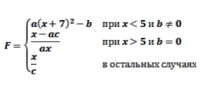

# Основы программирования. Лабораторная работа №3

## Вычисление кусочной ф-ции

### Вариант 19



Сборка проекта:

```bash
make
```

В каталоге **bin** будут размещена программа:

* calc

Программа вичисляет и выводит на экран в виде таблицы значения ф-ции *F* на интервале [*Xнач*, *Xкон*] с шагом *dx* и с учётом коэффициентов *a*, *b*, *c*.


### Пример выполнения

```text
./bin/calc
Input x0:1
Input xn:10
Input dx:1
Input a:1
Input b:2
Input c:3
          X Y
          1 62
          2 79
          3 98
          4 119
          5 1.67
          6 2
          7 2.33
          8 2.67
          9 3
         10 3.33

```
